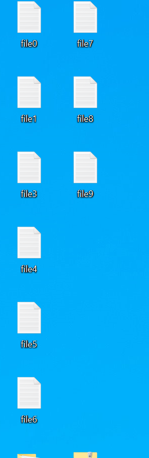
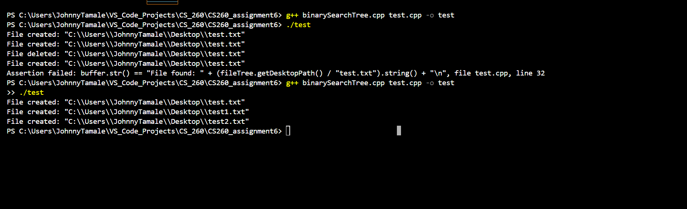

# CS260_assignment6
This is a screenshot of my desktop when a files are created. Check out the custom messages by running bstOWV.cpp

# Here are the test prints from bstOWV.cpp
PS C:\Users\JohnnyTamale\VS_Code_Projects\CS_260\CS260_assignment6>  & 'c:\Users\JohnnyTamale\.vscode\extensions\ms-vscode.cpptools-1.20.5-win32-x64\debugAdapters\bin\WindowsDebugLauncher.exe' '--stdin=Microsoft-MIEngine-In-ndaepmrv.op3' '--stdout=Microsoft-MIEngine-Out-dj3xp0ig.p3m' '--stderr=Microsoft-MIEngine-Error-zvwmlbzp.aab' '--pid=Microsoft-MIEngine-Pid-oubvjqiu.y3u' '--dbgExe=C:\msys64\ucrt64\bin\gdb.exe' '--interpreter=mi'
File created: "C:\\Users\\JohnnyTamale\\Desktop\\file0.txt"        
File created: "C:\\Users\\JohnnyTamale\\Desktop\\file1.txt"        
File created: "C:\\Users\\JohnnyTamale\\Desktop\\file2.txt"        
File created: "C:\\Users\\JohnnyTamale\\Desktop\\file3.txt"        
File created: "C:\\Users\\JohnnyTamale\\Desktop\\file4.txt"        
File created: "C:\\Users\\JohnnyTamale\\Desktop\\file5.txt"        
File created: "C:\\Users\\JohnnyTamale\\Desktop\\file6.txt"        
File created: "C:\\Users\\JohnnyTamale\\Desktop\\file7.txt"        
File created: "C:\\Users\\JohnnyTamale\\Desktop\\file8.txt"        
File created: "C:\\Users\\JohnnyTamale\\Desktop\\file9.txt"        
Files in BST (in-order Traversal): Visiting left child of file0.txt
Visiting node file0.txt
Visiting right child of file0.txt
Visiting left child of file1.txt
Visiting node file1.txt
Visiting right child of file1.txt
Visiting left child of file2.txt
Visiting node file2.txt
Visiting right child of file2.txt
Visiting left child of file3.txt
Visiting node file3.txt
Visiting right child of file3.txt
Visiting left child of file4.txt
Visiting node file4.txt
Visiting right child of file4.txt
Visiting left child of file5.txt
Visiting node file5.txt
Visiting right child of file5.txt
Visiting left child of file6.txt
Visiting node file6.txt
Visiting right child of file6.txt
Visiting left child of file7.txt
Visiting node file7.txt
Visiting right child of file7.txt
Visiting left child of file8.txt
Visiting node file8.txt
Visiting right child of file8.txt
Visiting left child of file9.txt
Visiting node file9.txt
Visiting right child of file9.txt

File found: "C:\\Users\\JohnnyTamale\\Desktop\\file2.txt"
File found: "C:\\Users\\JohnnyTamale\\Desktop\\file0.txt"
File found: "C:\\Users\\JohnnyTamale\\Desktop\\file1.txt"
File found: "C:\\Users\\JohnnyTamale\\Desktop\\file2.txt"
File found: "C:\\Users\\JohnnyTamale\\Desktop\\file3.txt"
File found: "C:\\Users\\JohnnyTamale\\Desktop\\file4.txt"
File found: "C:\\Users\\JohnnyTamale\\Desktop\\file5.txt"
File found: "C:\\Users\\JohnnyTamale\\Desktop\\file6.txt"
File found: "C:\\Users\\JohnnyTamale\\Desktop\\file7.txt"
File found: "C:\\Users\\JohnnyTamale\\Desktop\\file8.txt"
File found: "C:\\Users\\JohnnyTamale\\Desktop\\file9.txt"
File deleted: "C:\\Users\\JohnnyTamale\\Desktop\\file2.txt"
Files in BST (in-order Traversal): Visiting left child of file0.txt
Visiting node file0.txt
Visiting right child of file0.txt
Visiting left child of file1.txt
Visiting node file1.txt
Visiting right child of file1.txt
Visiting left child of file3.txt
Visiting node file3.txt
Visiting right child of file3.txt
Visiting left child of file4.txt
Visiting node file4.txt
Visiting right child of file4.txt
Visiting left child of file5.txt
Visiting node file5.txt
Visiting right child of file5.txt
Visiting left child of file6.txt
Visiting node file6.txt
Visiting right child of file6.txt
Visiting left child of file7.txt
Visiting node file7.txt
Visiting right child of file7.txt
Visiting left child of file8.txt
Visiting node file8.txt
Visiting right child of file8.txt
Visiting left child of file9.txt
Visiting node file9.txt
Visiting right child of file9.txt

File not found: "C:\\Users\\JohnnyTamale\\Desktop\\file2.txt"

# This is the output after reworking the code to work with g++ and adding a header file. Some of the tests were unable to work
